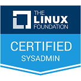
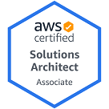
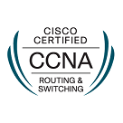
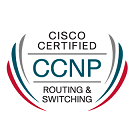
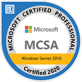
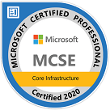
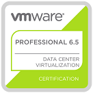

### PROJECT PORTFOLIO

- **[Click to view my project portfolio](./projects)**

 

### CAREER PROFILE

- 10+ years of **IT Systems Administration & Support experience** in designing, managing and troubleshooting on-prem and cloud infrastructure involving Windows/Linux servers & workstations, virtualisation, custom software, IT security, printing, storage, backup & networking solutions. 

- **Certifications** - AWS Solutions Architect Associate, Microsoft MCSE MCSA MCP, Azure Adminstrator Associate, Linux Foundation System Admin LFCSA, Vmware VCP-DCV, Cisco CCNA + CCNP 

|  |  |  |  |  |  |  |
|--------------------------------------|-------------------------------------------------------|----------------------------------------|----------------------------------------|------------------------------------------------|------------------------------------------------|--------------------------------------------|

**[Click to view summary of certifications](https://www.credly.com/users/md-emdadul-haque/badges?sort=-state_updated_at){:target="_blank"}**

Currently, upskilling on CI/CD and IaC DevOps tools (Ansible, Terraform, Jenkins, Docker and Kubernetes).

- **Infrastructure & virtualisation expert** - Proficient in Active Directory, Group Policy, DNS, DHCP, ADFS, PKI Certificates, SCCM SOE Imaging + app packaging, MDM, storage (SAN / NAS) & backup (Rubrik) systems, networking and virtualisation (VMware / Hyper-V). 

- **Cloud technologist** - Experienced with administration of AWS & Azure cloud infrastructure plus GCP WS & Office365 including Azure AD, Exchange OL, SharePoint OL, Teams, SSO, MFA plus migrations and on-prem sync.

- **Automation specialist** - Skilled at PowerShell, PowerCLI, Python, VB and BASH scripting. Developed desktop and web apps using various programming languages C++ / C# / VB .NET / PHP / JS + HTML + CSS & SQL DBs. 

- **Networking know-how** - Cisco CCNA and CCNP certified network engineer, accustomed with configuring routing, switching, firewalls, ACLs, proxies and IP telephones.

- **Incident manager** - Resolved escalated incidents with permanent solutions whenever possible reducing incident count while using ServiceNow, Salesforce Hermes and JIRA.

- **Excellent communicator** - Delivering exceptional customer service and liaising with vendors. Experienced at developing documentation and training material. 

