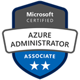

### CAREER PROFILE

- 12+ years of **IT Systems Design, Administration & Support** experience with on-premises and cloud environments involving Windows & Linux servers & workstations, virtualisation, specialised applications, printing, storage, backup & networking solutions with Security getting Priority 0.

- **Certifications** - Azure Adminstrator Associate, AWS Solutions Architect Associate, Microsoft MCSE MCSA MCP, Linux Foundation System Admin LFCSA, Vmware VCP-DCV, Cisco CCNA + CCNP 

     **[Click here to view certification verifications on Credly](https://www.credly.com/users/md-emdadul-haque/badges?sort=-state_updated_at){:target="_blank"}**

     
     
     
     
     
     
     
        

- **Infrastructure & virtualisation expert** - Proficient in Active Directory (AD), Group Policy, DNS, DHCP, ADFS, PKI Certificates, SCCM SOE Imaging + app packaging, MDM (Intune, AirWatch, MaaS360), storage (SAN / NAS) & backup (Rubrik) systems, networking and virtualisation (VMware / Citrix / Hyper-V). 

- **Cloud technologist** - Experienced with administration of AWS & Azure cloud infrastructure including identity management, multi-region replication, backups, disaster-recovery, SSO, MFA, monitoring, audits and cost management plus migrations and on-prem sync.  M365 / Office365 expertise including Exchange, SharePoint, Teams, PowerBI & Dynamics administration & licensing.

- **Automation specialist** - Skilled at automating deployments and configurations using PowerShell, PowerCLI, Python, VB and BASH scripting and IaC tools (CloudFormation, ARM, Terraform). Developed desktop and web apps using various programming languages and DB types. 

- **Networking know-how** - Cisco CCNA and CCNP certified network engineer, accustomed with configuring VPN, routing, switching, firewalls, ACLs, proxies and IP telephones.

- **Incident manager** - Resolved escalated incidents with permanent solutions whenever possible reducing incident count while using ServiceNow, ZenDesk, Salesforce / Hermes and JIRA.

- **Excellent communicator** - Delivering exceptional customer service and liaising with vendors. Experienced at developing documentation and training material. 

&nbsp;

### PROJECT PORTFOLIO

- Recently, I have started curating some of the work I have been involved in. **[Click here to view my project portfolio](./projects)**

&nbsp;

---

[Back to Top](#top)